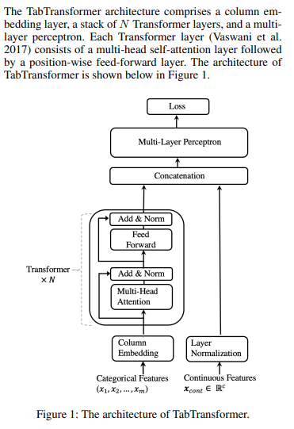
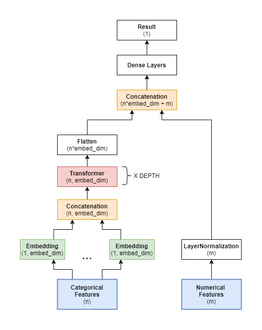

# TabTransformer

Implementation of [TabTransformer](https://arxiv.org/abs/2012.06678) in Keras.

## Usage

```python
import pandas as pd
from tab_transformer_keras import TabTransformer
from misc import get_X_from_features

df = pd.read_csv('data.csv')

cat_features  = ['cat1', 'cat2', 'cat3']
cont_features = ['cont1', 'cont2']

X = get_X_from_features(df, cont_features, cat_features)

tabTransformer = TabTransformer(
    categories = [4, 10, 5], # number of unique elements in each categorical feature
    num_continuous = 2,      # number of numerical features
    dim = 16,                # embedding/transformer dimension
    dim_out = 1,             # dimension of the model output
    depth = 6,               # number of transformer layers in the stack
    heads = 8,               # number of attention heads
    attn_dropout = 0.1,      # attention layer dropout in transformers
    ff_dropout = 0.1,        # feed-forward layer dropout in transformers
    mlp_hidden = [(32, 'relu'), (16, 'relu')] # mlp layer dimensions and activations
)

pred = tabTransformer.predict(X)
```

## Architecture

Following is the model architecture from the paper:



Following is a diagram showing the layers in my implementation:



## Credits

I used [this pytorch implementation of the TabTransformer](https://github.com/lucidrains/tab-transformer-pytorch) as reference.

I borrowed the code for the Transformer layer from [this keras documentation](https://keras.io/examples/nlp/text_classification_with_transformer/). 
